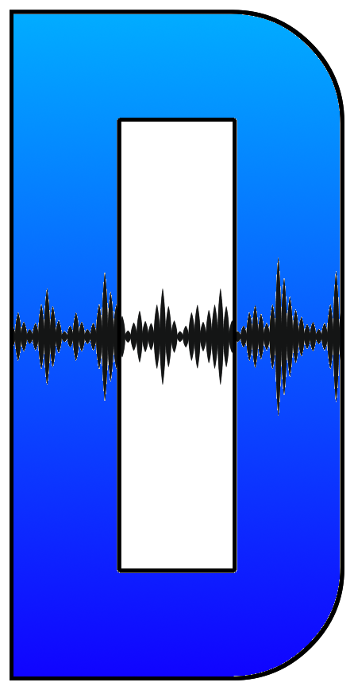
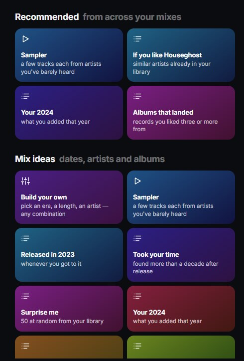

<div align="center">



# DeepDive

### Hear it all.

DeepDive knows what's already in your Spotify library, so every playlist
it builds is made of the songs you missed.

**[Open DeepDive →](https://jpluker.github.io/DeepDive/app/)** ·
[What it does](https://jpluker.github.io/DeepDive/) ·
[Setup](#getting-started)

[](LICENSE)


</div>

---

## Start with an artist

Name anyone and pick how far in to go.

| | | |
|---|---|---|
| **Dip** | their best hour, most played first | a short introduction, or a refresher before a gig |
| **Dive** | their whole catalogue against your library | every album, single and EP, held up against your Liked Songs |
| **Multi-Dip** | a whole bill in one playlist | everyone on the lineup, in the order they play |

A **Dive** matches recordings rather than titles, so the album cut you
saved still counts when the single turns up. You get back what you
already own under another release, and what you have never heard.
Review the split, untick anything, then like the songs, build a
playlist, or both.

A **Multi-Dip** takes the lineup. Drag the acts into running order, tag
who you are really there for as More and the opener as Less, and say how
long the night runs. It builds one playlist that plays like the night.

## Your library, cut dozens of ways

<div align="center">

</div>

Years, albums you went deep on, songs you found a decade late, artists
you liked exactly one track by. Build your own from an era, a length and
an artist, or let **Sampler** pull a few songs each from artists you
barely touched.

Add a free [Last.fm key](https://www.last.fm/api/account/create) and you
also get **Dips**, **Multi-Dips**, similar-artist recommendations, and
genre mixes that go well past "rock".

## The rest of it

- **The Crate** — artists you mean to get to, saved for later. Star a
  few and they lead your home screen. Sort by who you haven't dived
  yet, or build a sampler from the whole crate.
- **Album order that means something** — records in chronological
  sequence, tracks in their intended running order. Press play and hear
  a catalogue the way it was meant to be heard.
- **It knows a re-release from a remix** — a live take, an acoustic
  version, a remaster: different recordings, treated that way. The same
  recording on a different sleeve is what gets flagged.
- **Filters** — drop live cuts, radio edits, instrumentals or a cappella
  versions. Pull in compilations, or go further and include records an
  artist only guests on.
- **Your whole library at once** — the full scan crawls every artist
  you've liked. It takes a while, and you can stop it whenever; it keeps
  what it found.
- **A cover for every playlist** — the artist's photo, the kind of mix,
  and the DeepDive mark. A Multi-Dip splits it between the bill.
- **Take it back** — dive history lists what you dived and what DeepDive
  built. Songs it added come off again with one tap.
- **Dark mode.** Obviously.

Nothing reaches Spotify until you choose it. Build the same playlist
again later and DeepDive adds to it rather than making a second one.

## It can't collect your data

There is no DeepDive server, database or account system, so there is
nowhere for your listening to go. Your library is read by your browser
and stays on your device. The only requests that leave it are the ones
to Spotify and Last.fm that fetch what you asked for.

## Put it on your home screen

DeepDive installs like a real app, without an app store:

| iPhone / iPad | Android | Desktop |
|---|---|---|
| Share → *Add to Home Screen* | menu → *Install app* | the install icon in the address bar |

Opens fullscreen. Own icon. No one would know it's a website.

---

## Getting started

Spotify requires every app that touches your library to have its own
credentials, so there is a one-time step before your first dive. Two
minutes, and you never do it again. The app walks you through it; this
is the same thing written down.

> [!IMPORTANT]
> You'll need **Spotify Premium**. Spotify only runs apps like this one
> for Premium accounts.

**1.** Open the [Spotify Developer Dashboard](https://developer.spotify.com/dashboard)
and click **Create app**. Any name works.

**2.** In the app's settings, add this as a **Redirect URI**, then click
Add *and* Save:

```
https://jpluker.github.io/DeepDive/app/
```

> [!WARNING]
> Copy it exactly. The `/app/` and the trailing slash both matter, and
> `https` is not the same as `http`.

**3.** Copy the **Client ID** from your app's page,
[open DeepDive](https://jpluker.github.io/DeepDive/app/), and paste it
in. There is no client secret; DeepDive doesn't use one.

**4.** Optionally add a [Last.fm API key](https://www.last.fm/api/account/create).
Free, approved instantly, and it turns on Dips, Multi-Dips,
recommendations and genre mixes. You can add it later in Settings.

**5.** Connect Spotify, approve access, and start digging.

<details>
<summary><strong>If something goes wrong</strong></summary>

**"Invalid redirect URI"** — the address in your Spotify app settings
doesn't match exactly. Check the `/app/`, the trailing slash and
`https`, and make sure you hit Save at the bottom.

**"Missing or expired permissions"** — open Settings, Disconnect
Spotify, then connect again.

**Dip and Multi-Dip are greyed out** — they need a Last.fm key. Add one
in Settings.

**"Too many requests"** — Spotify throttled you for scanning a lot at
once. Wait a couple of minutes.

**A scan is taking forever** — big catalogues genuinely take time, since
every release is read track by track. Including records an artist only
guests on makes it much slower: a prolific session player can have
hundreds, at one request each. Compilations alone are cheap.

</details>

<details>
<summary><strong>Running it yourself</strong></summary>

DeepDive is a static site. `docs/` is the whole thing: `docs/index.html`
is the marketing page and `docs/app/` is the app. Serve that directory
however you like, and register your own copy's address as the Redirect
URI in place of the one above.

```bash
git clone https://github.com/JPLuker/DeepDive.git
cd DeepDive
python3 -m http.server -d docs 8000   # then open http://localhost:8000/app/
bash tests/run.sh                     # the test suite, no network needed
```

</details>

---

## Licence and credits

DeepDive's own source code is under the [MIT licence](LICENSE).

That covers the code and nothing else. Music metadata and artwork come
from Spotify; artist tags and popularity come from Last.fm. All of it
belongs to its owners, not to this project, and is subject to their
terms. DeepDive is not affiliated with Spotify AB or Last.fm.

---

<div align="center">

**[Start digging →](https://jpluker.github.io/DeepDive/)**

</div>
